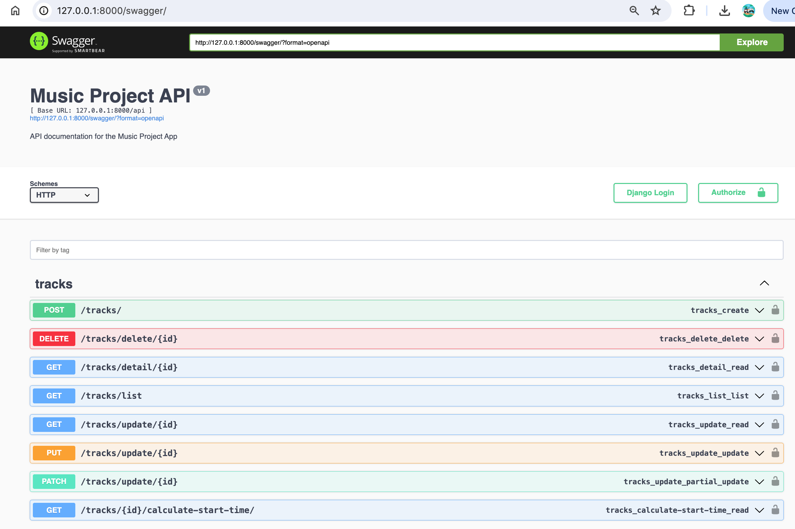
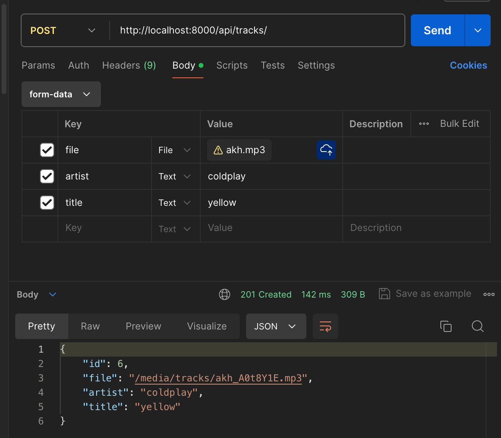
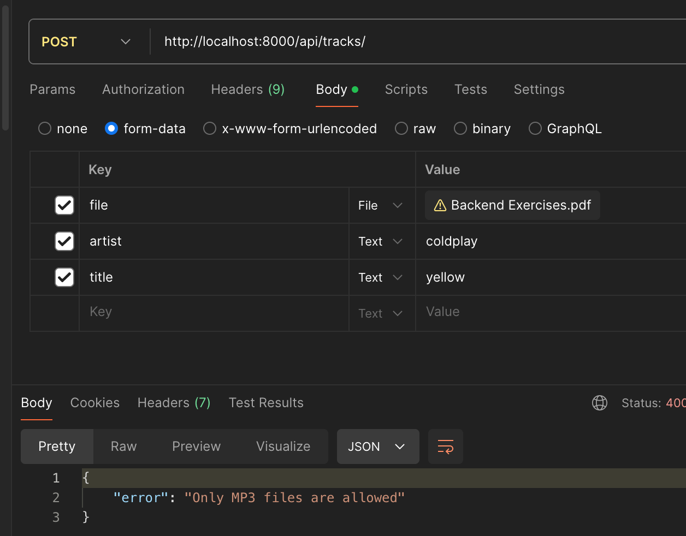
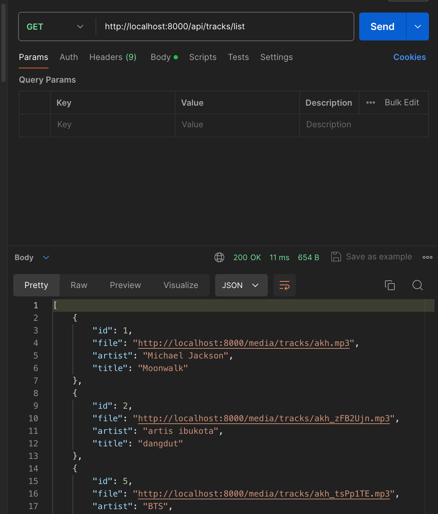
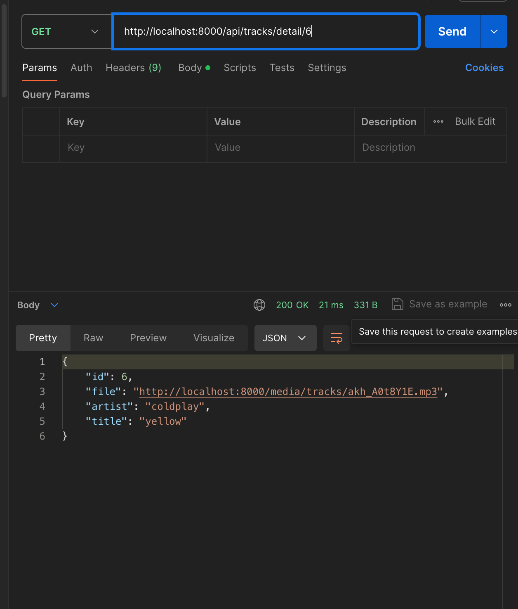
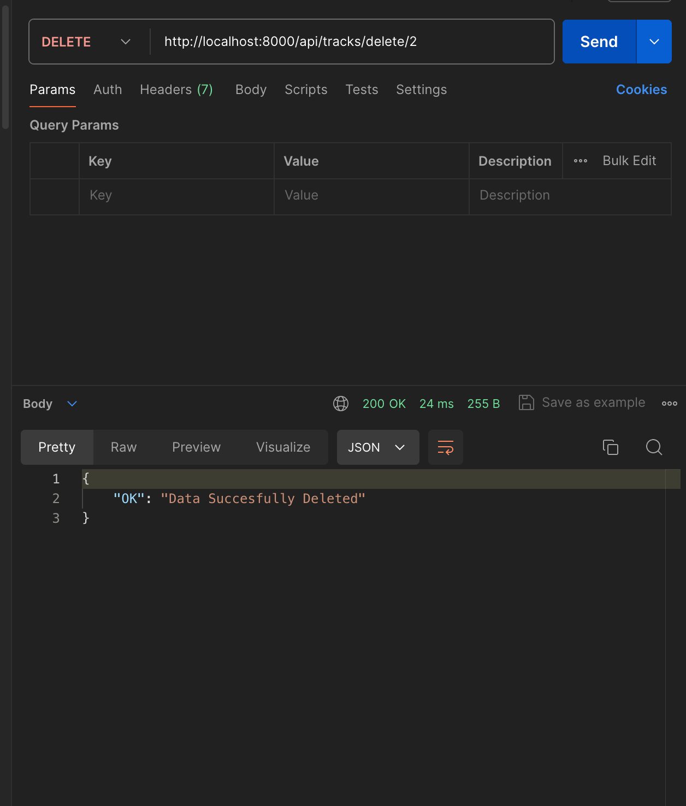
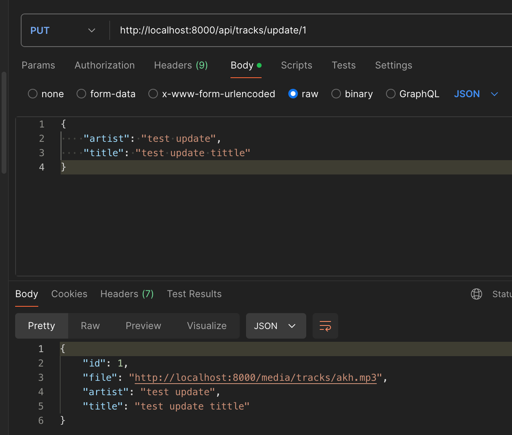
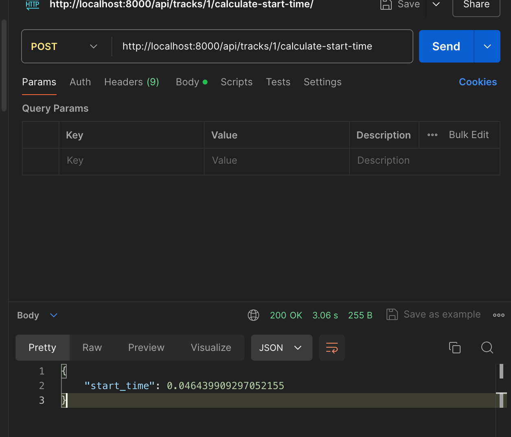

# music-project-test


## Repo

```bash
git clone : https://github.com/Adityapfm99/music_project
```

## Activate a virtual environment
```bash
source env/bin/activate
```

## Migrate 
```bash
 python manage.py migrate
```

## Run 
```bash
 python manage.py runserver
```

## CURL 
```bash
    POST

    curl --location 'http://localhost:8000/api/tracks/' \
    --form 'file=@"/Users/aditya/Downloads/akh.mp3"' \
    --form 'artist="Michael Jackson"' \
    --form 'title="Moonwalk"'

    GET

    curl --location --request GET 'http://localhost:8000/api/tracks/list' \
    --form 'file=@"/Users/aditya/Downloads/akh.mp3"' \
    --form 'artist="Michael Jackson12"' \
    --form 'title="Moonwalk"'

    GET DETAIL

    curl --location --request GET 'http://localhost:8000/api/tracks/detail/<:tracksId>' \
    --form 'file=@"/path/to/file"' \
    --form 'artist="Michael Jackson12"' \
    --form 'title="Moonwalk"'

    DELETE

    curl --location --request DELETE 'http://localhost:8000/api/tracks/delete/<:tracksId>'

    PUT
    curl --location --request PUT 'http://localhost:8000/api/tracks/update/<:tracksId>' \
    --header 'Content-Type: application/json' \
    --data '{
        "artist": “bon  jovi”,
        "title": "test Title bon”
    }'

    POST
    curl --location 'http://localhost:8000/api/tracks/<:tracksId>/calculate-start-time' \
    --form 'file=@"/path/to/file"' \
    --form 'artist="Michael Jackson12"' \
    --form 'title="Moonwalk"'
```


## API DOCS (Swagger)
```bash
 http://127.0.0.1:8000/docs/ 
 or  
 http://127.0.0.1:8000/swagger/ 
```



## Django Challenge 1
```bash
 Create
```


```bash
 validation
```



```bash
 Get List & Detail
```



```bash
 Delete
```


```bash
 update
```


## Django Challenge 2
