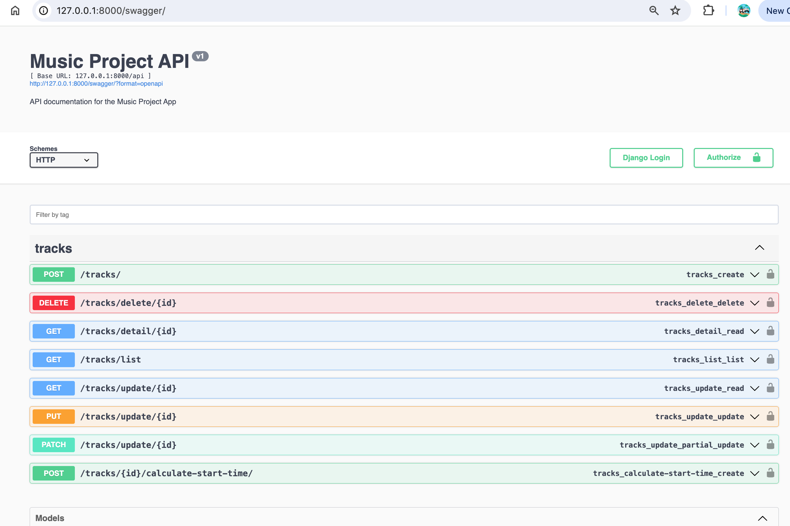

# music-project-test


## Clone

```bash
git clone : https://github.com/Adityapfm99/music_project
```

## activate a virtual environment
```bash
source venv/bin/activate
```

## Migrate 
```bash
 python manage.py migrate
```

## Run 
```bash
 python manage.py runserver
```

## CURL 
```bash
    POST

    curl --location 'http://localhost:8000/api/tracks/' \
    --form 'file=@"/Users/aditya/Downloads/akh.mp3"' \
    --form 'artist="Michael Jackson"' \
    --form 'title="Moonwalk"'

    GET

    curl --location --request GET 'http://localhost:8000/api/tracks/list' \
    --form 'file=@"/Users/aditya/Downloads/akh.mp3"' \
    --form 'artist="Michael Jackson12"' \
    --form 'title="Moonwalk"'

    GET DETAIL

    curl --location --request GET 'http://localhost:8000/api/tracks/detail/1' \
    --form 'file=@"/path/to/file"' \
    --form 'artist="Michael Jackson12"' \
    --form 'title="Moonwalk"'

    DELETE

    curl --location --request DELETE 'http://localhost:8000/api/tracks/delete/4'

    PUT
    curl --location --request PUT 'http://localhost:8000/api/tracks/update/2' \
    --header 'Content-Type: application/json' \
    --data '{
        "artist": “bon  jovi”,
        "title": "test Title bon”
    }'
```


## API DOCS (Swagger)
```bash
 http://127.0.0.1:8000/docs/
```




